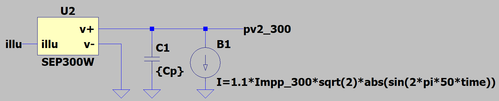
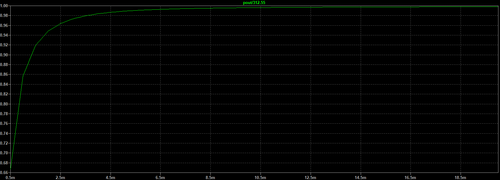

# OpenCE

## Was ist unser Ziel?

Wir wollen einen Open Source Mikro-Wechselrichter bauen.

## Welche Spezifikationen soll der Mikro-Wechselrichter haben?

Vorbehaltlich weiterer Änderungen soll der Mikro-Wechselrichter folgende technischen Daten haben:
- Wirkungsgrad > 90%
- Betriebsbereich: 16V - 58V
- Eingangsleistung vom Solarmodul: 350W - 550W
- Leistung: 400VA mit Möglichkeit zur softwareseitigen Begrenzung
- Power Faktor ≈ 1
- Total Harmonic Distortion (THD) < 5%
- Elektrische Isolation zwischen Solarmodul und Netzspannung
- Temperaturbereich: -40 °C bis 60 °C
- Schnittstellen:
  - WIFI mit [SunSpec Modbus](https://sunspec.org/sunspec-modbus-specifications/)
  - Powerline Communication (PLC)

Optionale Features:
- Einstellbarer Power Faktor

## Wie soll der Mikro-Wechselrichter technisch umgesetzt werden?

Die technische Umsetzung des Mikro-Wechselrichters wird im Projektverlauf stetig überarbeitet und iterativ verbessert. Anmerkungen und Verbesserungsvorschläge sind hier gerne gesehen!

### Topologie

TODO: Push-Pull mit Gain usw.

### Mikrocontroller

ESP32

## Wie kann der Mikro-Wechselrichter simuliert werden?

Das Schaltungsdesign des Mikro-Wechselrichters wurde in [LTspice](https://www.analog.com/en/design-center/design-tools-and-calculators/ltspice-simulator.html) simuliert. Alle LTspice Simulationen sind im Ordner [simulation](simulation) abgelegt.
Da das gesamte Schaltungsdesign schnell komplex und aufwändig zu simulieren ist, wurden die einzelnen Bausteine der Schaltung zunächst einzeln aufgebaut und simuliert.

### Solarmodul und Auslegung der Eingangskapazität
Ein [Solarmodul in LTspice](simulation/pv-panel-input) wurde nach der Anleitung von [FesZ Electronics](https://www.youtube.com/watch?v=ox0UtYe4owI) modelliert.

Die vom Solarmodul abgegebene Leistung berechnet sich nach $P_{PV} = U_{PV} \cdot I_{PV}$.

Zunächst kann für das simulierte Solarmodul der Punkt gefunden werden, an dem die Leistung $P_{PV}$ maximal ist. Dieser Punkt wird auch Maximum Power Point (MPP) und kann in LTSpice grafisch ermittelt werden, indem die Leistung $P_{PV}$ (in der Grafik V(pv1) $\cdot$ I(I1)) über der Stromstärke $I_{PV}$ (in der Grafik I(I1)) des Solarmoduls dargestellt wird.

Für das in der Simulation verwendete 300-320 Watt [Solarmodul von sunceco](http://sunceco.com/wp-content/uploads/2017/01/SEP300-320.pdf) ergibt sich ein grafisch ermittelter Maximum Power Point für $P_{MPP} = 312,55$ W für $I_{MPP} = 8,31$ A und $U_{MPP} = 37,61$ V.

Da der Wechselrichter den Strom aus dem Solarmodul entsprechend der Netzfrequenz sinusförmig einspeisen soll, kann zur
Zur Auslegung der Eingangskapazität eine gleichgerichtete sinusförmige Stromquelle an den Ausgang des Solarmoduls angeschlossen werden.

Anschließend können für diesen Aufbau die Werte der Eingangskapazität Cp variiert und dabei die durchschnittliche Ausgangsleistung $P_{out}$ des Solarmoduls gemessen werden. Wird die gemessene Ausgangsleistung $P_{out}$ auf die maximal mögliche Ausgangsleistung $P_{MPP}$ normiert und über verschiedenen Werten von Cp dargestellt, ergibt sich folgende Kurve:

### Push-Pull Wechselrichter 
Die [Simulation des Push-Pull Wechselrichters](simulation/push-pull-inverter) ... TODO

#### Auslegung des Transformators

TODO:
