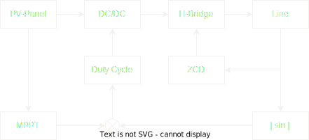

# openMI

## What is our goal?

We want to build an open source micro-inverter.

## What specifications should the micro-inverter have?

Subject to further modifications, the micro-inverter should have the following specifications:
- Efficiency > 90%
- Operating range: 16V - 58V
- Input power from solar panel: 350W - 550W
- Power: 400VA with possibility of software limitation.
- Power factor ≈ 1
- Total Harmonic Distortion (THD) < 5%.
- Electrical isolation between solar module and grid voltage
- Temperature range: -40 °C to 60 °C
- Interfaces:
  - WIFI with [SunSpec Modbus](https://sunspec.org/sunspec-modbus-specifications/)
  - Powerline Communication (PLC)

Optional features:
- Adjustable Power Factor

## How will the micro-inverter be technically implemented?

The technical implementation of the micro-inverter will be continuously revised and iteratively improved during the course of the project. Comments and suggestions for improvement are welcome here!

### Control system

During basic research, we came across the paper [^1]. The paper proposes a relatively simple and low-cost control system that yields promising results. We took our cue from this control scheme and adapted it for our purposes.

  

The Duty Cycle $D$ is determined by the MPPT algorithm and the grid voltage. For a given maximum duty cycle $D_{max}$ and control value from the MPPT algorithm $k$, the duty cycle is calculated as follows: 

$$ D(t) = D_{max} \cdot k \cdot | sin(2 \pi f t) | $$

$$ D\left(\frac{n}{2f}\right) = 0 ~~|~ n\in \mathbb{N_0} $$

$$ D\left(\frac{2n+1}{4f}\right) = D_{max} \cdot k ~~|~ n \in \mathbb{N_0} $$

At zero crossing of the line voltage, the duty cycle is $D = 0$. When the line voltage reaches its maximum value, the Duty Cycle is $D = D_{max} \cdot k$. 

### Topology

TODO: Push-pull with gain etc.

### Transformer

TODO:

### Microcontroller

ESP32

## Footnotes

[^1]: [Flyback Photovoltaic Micro-Inverter with a Low Cost and Simple Digital-Analog Control Scheme](https://www.researchgate.net/publication/353247133_Flyback_Photovoltaic_Micro-Inverter_with_a_Low_Cost_and_Simple_Digital-Analog_Control_Scheme) | http://dx.doi.org/10.3390/en14144239